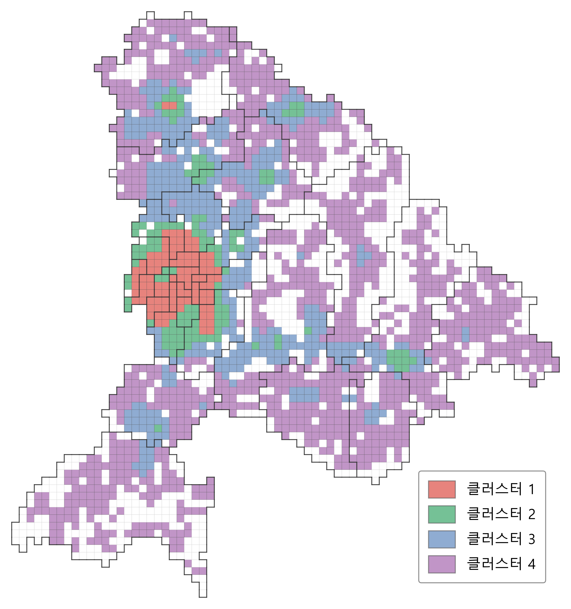
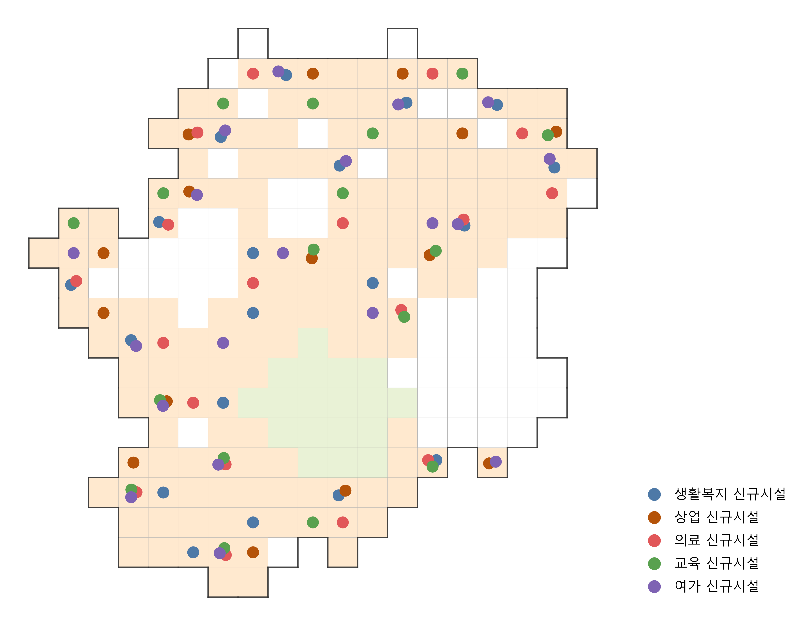

# 천안시 생활서비스 취약지역 개선을 위한 최적 입지분석

> **2026년 천안시 AI·데이터 기반 정책 아이디어 경진대회** 팀 프로젝트
> 500m 격자 기반 공간분석과 최적화 기법을 활용해 생활서비스 취약지역을 식별하고, 신규 시설의 우선 입지 후보를 제안했습니다.

## 프로젝트 개요

천안시를 500m × 500m 격자로 세분화하여 **인구 수요와 생활서비스 공급 수준을 공간적으로 분석**했습니다. 생활복지·상업·의료·교육·여가 시설을 바탕으로 격자별 생활지수를 구축하고, 인구수요와 생활서비스 특성에 따라 지역 유형을 구분했습니다.

이후 **LSCP (Location Set Covering Problem)** 를 적용하여 기존 시설의 서비스 범위에서 벗어난 인구 거주지역을 식별하고, 해당 수요를 효율적으로 커버할 수 있는 신규 시설 후보 입지를 탐색했습니다. 마지막으로 시설 배치 수준에 따른 생활지수와 지역 유형의 변화를 비교하여 단계적인 정책 활용 가능성을 검토했습니다.

| 항목    | 내용                                  |
| ----- | ----------------------------------- |
| 분석 지역 | 충청남도 천안시                            |
| 분석 단위 | 500m × 500m 격자                      |
| 핵심 방법 | 공간 데이터 분석, K-Means 군집화, LSCP 최적입지분석 |
| 분석 목표 | 생활서비스 취약지역 식별 및 신규 시설 입지 후보 제안      |

## 문제 정의

생활서비스의 지역 격차를 평가할 때는 단순한 시설 수뿐 아니라, **실제 인구가 거주하는 위치에서 해당 시설에 얼마나 접근하기 쉬운지**를 함께 고려해야 합니다.

특히 동일한 읍면동 안에서도 인구와 시설의 공간적 분포가 다를 수 있기 때문에, 행정구역 단위의 평균이나 시설 총량만으로는 세부적인 서비스 공백을 파악하기 어렵습니다.

본 프로젝트는 15분 도시의 생활권 개념을 참고하여 천안시의 생활서비스 접근성을 500m 격자 단위에서 분석하고, 서비스가 상대적으로 부족한 지역과 신규 시설의 우선 입지 후보를 도출하는 것을 목표로 했습니다.

## 분석 방법

### 1. 데이터 통합 및 격자 데이터 구축

* 생활복지, 상업, 의료, 교육, 여가 관련 시설 데이터를 통합했습니다.
* 주소만 제공되는 시설은 지오코딩을 통해 좌표를 보완했습니다.
* 인구·세대·생활시설 정보를 500m 격자 단위로 집계하여 공간분석용 데이터셋을 구축했습니다.

### 2. 생활지수 및 인구수요지수 산출

* 각 격자뿐 아니라 주변 1,000m 이내의 인구와 시설도 거리 가중 방식으로 반영했습니다.
* 생활복지, 상업, 의료, 교육, 여가의 5개 생활지수와 인구·세대 기반의 인구수요지수를 산출했습니다.
* 시설 및 사업체 변수는 `log1p` 변환과 표준화를 거쳐 일부 지역의 극단적인 값이 지수에 과도한 영향을 미치지 않도록 조정했습니다.

### 3. 생활권 유형화

* 인구수요지수와 5개 생활지수를 기반으로 K-Means 클러스터링을 수행했습니다.
* 격자별 생활서비스 특성을 4개의 생활권 유형으로 구분했습니다.
* 이후 격자별 결과를 인구 기준으로 집계하여 읍면동별 대표 클러스터를 도출했습니다.

### 4. 최적 입지분석 및 사후분석

* 기존 시설의 서비스 범위에 포함되지 않는 인구 거주 격자를 **미충족 수요 격자**로 정의했습니다.
* 각 생활서비스별로 미충족 수요를 1,000m 이내에서 커버하는 최소 후보 입지 조합을 LSCP로 탐색했습니다.
* 선정된 후보지에 시설을 단계적으로 배치하는 시나리오를 구성하고, 생활지수와 지역 유형이 어떻게 변화하는지 비교했습니다.

## 주요 결과

### 1. 500m 격자 기반 생활서비스 지역 유형화

500m 격자별 인구수요와 생활서비스 수준을 기반으로 K-Means 군집화를 수행했습니다.

이를 통해 동일한 읍면동 안에서도 **인구 규모와 생활서비스 접근성이 서로 다른 공간이 공존**한다는 점을 확인했으며, 행정구역 평균으로는 드러나기 어려운 생활서비스 취약 격자를 세밀하게 구분할 수 있었습니다.



### 2. 읍면동별 대표 생활권 유형 도출

격자 단위 군집 결과를 인구 기준으로 집계하여 각 읍면동의 대표 생활권 유형을 도출했습니다.

이를 통해 격자 단위에서 확인한 세부적인 공간 차이를 행정·정책 단위에서도 해석할 수 있도록 연결하고, 지역별 특성에 따라 서로 다른 생활서비스 개선 방향을 검토했습니다.


### 3. LSCP 기반 신규 시설 후보지 탐색

기존 시설로 충분히 커버되지 않는 인구 거주 격자를 미충족 수요 지역으로 정의하고, LSCP를 적용하여 해당 수요를 커버하기 위한 **최소 신규 시설 후보지 조합**을 탐색했습니다.

아래 지도는 성환읍을 대상으로 도출한 생활서비스 신규 시설 후보지의 예시입니다.



### 4. 시설 배치 수준에 따른 변화 비교

모든 후보지에 시설을 한 번에 배치하는 경우만을 고려하지 않고, 후보 입지의 일부를 우선적으로 선택하는 단계별 시나리오를 추가로 분석했습니다.

이를 통해 지역마다 동일한 시설 투자가 같은 수준의 개선으로 이어지지 않으며, **적은 수의 시설 추가만으로 변화 가능성이 높은 지역과 장기적인 접근이 필요한 지역을 구분**할 수 있었습니다.

## 주요 수행 역할

- 주제 및 아이디어 선정, 데이터 수집
- 생활지수 산출 및 K-means 기반 생활권 유형화 보완
- 시설 배치 시나리오별 생활지수 및 생활권 유형 변화에 대한 사후분석 보완

## 분석 노트북

| 순서 | 파일                                        | 내용                    |
| -- | ----------------------------------------- | --------------------- |
| 1  | `cheonan_integrate_facilities_data.ipynb` | 생활시설 데이터 통합 및 좌표 보완   |
| 2  | `cheonan_allocate_grid_population.ipynb`  | 격자별 인구·세대 배정          |
| 3  | `cheonan_allocate_grid_facilities.ipynb`  | 격자별 생활시설 배정           |
| 4  | `cheonan_grid_analysis.ipynb`             | 생활지수 산출 및 군집 분석       |
| 5  | `cheonan_lscp_post_analysis.ipynb`        | LSCP 최적 입지분석 및 사후분석   |
| 6  | `cheonan_facility_plan_analysis.ipynb`    | 시설 배치 시나리오 및 정책 방향 분석 |
| -  | `code-visual.ipynb`                       | 분석 결과 시각화             |

## 저장소 구조

```text
.
├── grid_inputs/              # 원본 및 중간 입력 데이터
├── grid_outputs/             # 격자 단위 분석 결과
├── visualization_outputs/    # 지도 및 보고서용 시각화 결과
├── [1]~[6] *.ipynb           # 분석 파이프라인 노트북
├── code-visual.ipynb         # 결과 시각화 노트북
└── 설테통_최적 입지분석을 통한 천안시 생활서비스 취약지역 개선.pdf
```

## 데이터 안내

분석에는 공개 공간정보와 이를 바탕으로 생성한 전처리 데이터가 사용되었습니다.

자세한 전처리 과정은 코드에 공개되어 있습니다.

## 팀

심현석 · 이성진 · 이혁진

본 프로젝트는 팀 프로젝트로 수행되었습니다.
